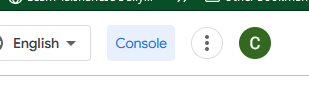
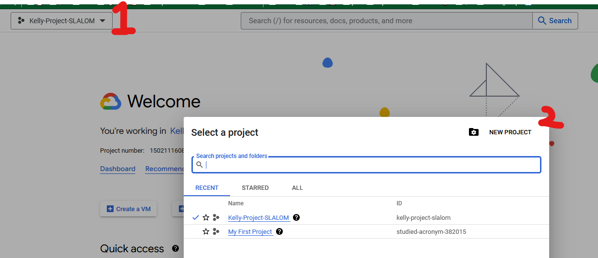
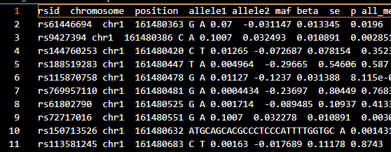
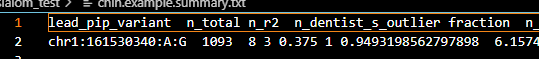

# Notes

So this repo was mainly to explore SLALOM's local usage. There is a `wdl` and docker setup to run on gcloud. Might want to use that if given the option but anyways ...

## Setup

### [Clone the conda environment](https://github.com/conda/conda/issues/8372#issuecomment-1099222773):
```
$ conda create --name slalom --file conda_env/spec-file.txt
$ conda env update --name slalom --file conda_env/environment.yml
$ conda activate slalom
$ pip install -r conda_env/requirements.txt
```
- make sure pip is the slalom pip (will have to use full path on prod3)

### setup google cloud
- slalom makes use of a few requestor pays buckets. 
  - TBH they are quite small and a pocket installation in the future should prolly use a different data distribution service
- we need to set up a [google cloud account](https://cloud.google.com/_d/signin?continue=https%3A%2F%2Fcloud.google.com%2F&prompt=select_account)
  - contact Chinmay if you just want to piggyback off of the lab's 🐖
- go to the console
  - 
- make a new project
  - 
- follow the instructions and **remember the project name**
- on the server run
  - `gcloud init`
  - follow the login instructions from the gcloud cli

### run slalom on the example
- create environment variable for **project name**
  - example: `export SLALOM_PROJECTNAME=kelly-project-slalom`
- if conda environment "slalom" is setup
  - `cmd_run.sh`
- otherwise correct python path in `cmd_run.sh` & run
- this should produce 2 output files:
  - `chin.example.slalom.txt`
    - 
    - list of all snps and results
  - `chin.example.summary.txt`
    - 
    - list of fine-mapped *suspicious* variants ඞ

### input file format
 - TODO: fill this out later 🦥